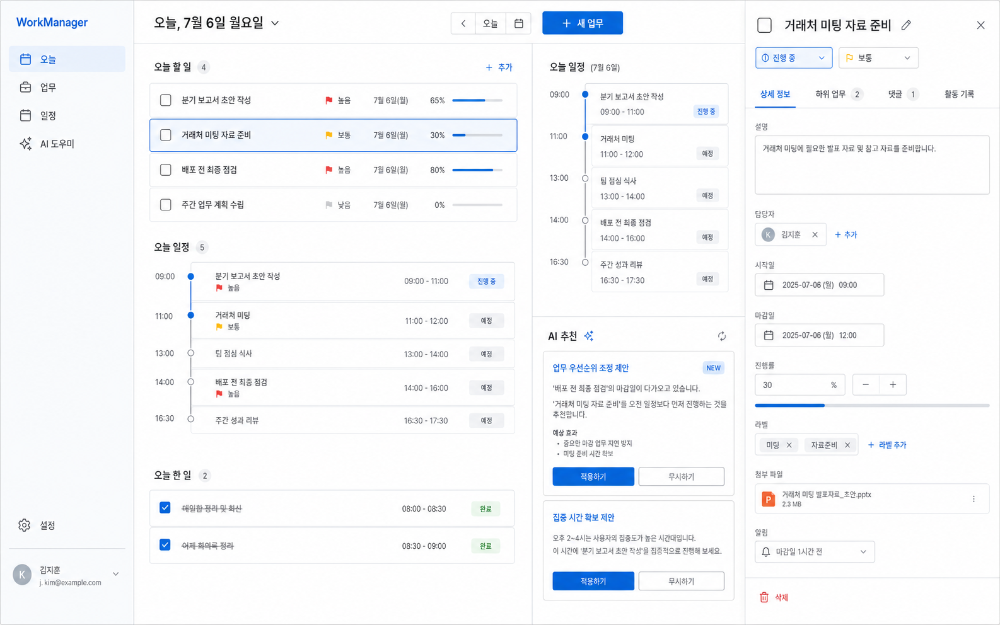
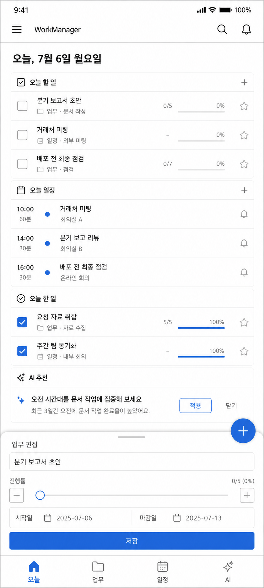

# WorkManager

PC, 태블릿, 휴대폰에서 함께 쓰는 개인 업무 관리 웹앱입니다. 할 일과 진행 중인 업무, Gantt 일정, 월·주·일 캘린더, 오늘의 Todo와 업무 기록을 한곳에서 관리합니다. 반응형 PWA이므로 브라우저에서 사용하거나 홈 화면에 설치할 수 있습니다.



## 권장 구성

- **앱:** React 기반 반응형 PWA. 한 번 배포하면 Windows PC와 Android 기기에서 같은 기능과 데이터를 사용합니다.
- **API/데이터:** FastAPI + SQLite. 데이터는 Docker 볼륨에 영구 저장됩니다.
- **로그인:** `.env`의 ID/PW가 기본이며 Google OpenID Connect(OIDC)를 선택적으로 켤 수 있습니다.
- **AI:** 앱은 OpenAI 호환 API를 호출합니다. 문장 구조화, 항목 수정, 오늘 할 일과 완료일 추천에 적합합니다.

현재 단계에는 네이티브 Android 앱보다 PWA가 알맞습니다. 배포와 업데이트가 한 번이면 되고, S10 Lite·S26 Ultra·PC에서 같은 화면을 쓸 수 있기 때문입니다. 기기 내 AI는 향후 Android 전용 보조 기능으로 붙일 수 있지만 모델 제공 여부와 기능이 기기마다 다르고, 전체 업무 문맥을 분석하는 작업에는 제약이 있습니다. 따라서 짧은 입력의 요약·민감정보 전처리는 온디바이스, 여러 태스크를 아우르는 추천과 일정 추론은 서버 AI API가 맡는 **하이브리드 방식**을 권장합니다.

## 빠른 시작

Docker Desktop과 Docker Compose가 필요합니다.

```powershell
Copy-Item .env.example .env
```

`.env`에서 최소한 아래 값을 변경합니다.

```dotenv
APP_LOGIN_ID=my-id
APP_LOGIN_PASSWORD=충분히-긴-비밀번호
APP_SECRET=길고-무작위인-세션-서명키
```

서명키는 다음 명령으로 만들 수 있습니다.

```powershell
python -c "import secrets; print(secrets.token_urlsafe(48))"
```

서비스를 빌드하고 실행합니다.

```powershell
docker compose up -d --build
docker compose ps
```

`work.ysyoo.link` 운영 배포는 DNS의 A/AAAA 레코드를 이 서버로 연결한 뒤 운영 오버레이를 함께 사용합니다.

```powershell
Copy-Item .env.production.example .env
docker compose -f docker-compose.yml -f docker-compose.prod.yml up -d --build
```

Caddy가 80/443 포트에서 인증서를 자동 발급·갱신합니다. 공유기 뒤의 서버라면 TCP 80·443을 서버로 전달하고 Windows 방화벽에서도 허용해야 합니다. Cloudflare 프록시를 사용한다면 SSL/TLS 모드는 `Full (strict)`를 권장합니다.

PC에서는 `http://localhost:8080`, 같은 Wi-Fi의 기기에서는 `http://<PC의-LAN-IP>:8080`으로 접속합니다. Windows 방화벽에서 8080/TCP 인바운드 허용이 필요할 수 있습니다. 단순 HTTP는 신뢰하는 내부망에서만 사용하세요. 외부 접속에는 직접 포트를 노출하지 말고 HTTPS 리버스 프록시, VPN(Tailscale 등) 또는 인증된 터널을 사용하십시오.

중지와 로그 확인:

```powershell
docker compose down
docker compose logs -f
```

`docker compose down -v`는 데이터 볼륨까지 삭제하므로 백업 없이 실행하지 마세요.

## 환경 변수

| 변수 | 필수 | 설명 |
|---|---:|---|
| `APP_LOGIN_ID` | 예 | 기본 로그인 ID |
| `APP_LOGIN_PASSWORD` | 예 | 기본 로그인 비밀번호. 저장소에 커밋하지 않습니다. |
| `APP_SECRET` | 예 | 로그인 세션 서명용 무작위 문자열 |
| `DATABASE_PATH` | 예 | 컨테이너 내부 SQLite 경로. 기본값 `/data/workmanager.db` |
| `TZ` | 권장 | 일정 기준 시간대. 기본값 `Asia/Seoul` |
| `GOOGLE_CLIENT_ID` | 아니요 | Google OAuth 클라이언트 ID |
| `GOOGLE_CLIENT_SECRET` | 아니요 | Google OAuth 클라이언트 보안 비밀 |
| `GOOGLE_ALLOWED_EMAIL` | 아니요 | 로그인 허용 Google 계정 이메일. 개인용이면 반드시 지정 권장 |
| `GOOGLE_REDIRECT_URI` | 아니요 | Google에 등록한 콜백 URL과 완전히 같아야 함 |
| `FRONTEND_URL` | 아니요 | OAuth 성공 후 이동할 앱 주소. 기본값 `/` |
| `COOKIE_SECURE` | 권장 | HTTPS 운영 환경에서는 `true`로 설정 |
| `CORS_ORIGINS` | 아니요 | 별도 개발 서버가 API를 호출할 때 허용할 Origin 목록 |
| `AI_API_KEY` | 아니요 | OpenAI 호환 서비스 API 키 |
| `AI_BASE_URL` | 아니요 | OpenAI 호환 API 기준 URL |
| `AI_MODEL` | 아니요 | 사용할 모델 이름 |

환경 변수를 바꾼 뒤에는 컨테이너를 다시 생성합니다.

```powershell
docker compose up -d --force-recreate
```

## 개인용 Google 로그인 설정

Google SSO는 개인 사용자도 사용할 수 있습니다. 별도 조직 계정은 필요하지 않으며, 본인 이메일만 허용하면 작은 개인 앱으로 운영하기 좋습니다.

1. [Google Cloud Console](https://console.cloud.google.com/)에서 프로젝트를 만듭니다.
2. Google Auth Platform에서 앱 이름과 지원 이메일을 설정합니다.
3. Audience를 외부(External)로 두고 본인 Google 계정을 테스트 사용자에 추가합니다. 앱을 공개 배포하지 않는다면 검증 절차 없이 테스트 사용자로 제한해 운용할 수 있습니다.
4. Clients에서 **Web application** OAuth 클라이언트를 만듭니다.
5. Authorized redirect URI에 앱의 정확한 콜백 주소를 등록합니다.
   - PC 전용 로컬 테스트: `http://localhost:8080/api/auth/google/callback`
   - 운영 주소: `https://work.ysyoo.link/api/auth/google/callback`
6. 발급된 ID와 비밀을 `.env`의 `GOOGLE_CLIENT_ID`, `GOOGLE_CLIENT_SECRET`에 넣습니다.
7. `GOOGLE_ALLOWED_EMAIL`에 본인 이메일을 넣어 다른 계정의 로그인을 차단합니다.

운영 환경에서는 `FRONTEND_URL=https://work.ysyoo.link`, `COOKIE_SECURE=true`를 사용합니다. 이 값은 `docker-compose.prod.yml`에 이미 고정되어 있습니다.

Google은 일반적인 LAN IP 기반 HTTP 콜백을 운영 주소로 쓰기 어렵습니다. 여러 기기에서 Google 로그인을 쓰려면 도메인이 연결된 HTTPS 주소를 마련하는 구성이 가장 안정적입니다. `GOOGLE_REDIRECT_URI`와 Console의 URI는 스킴, 호스트, 포트, 경로까지 한 글자도 다르면 안 됩니다. 클라이언트 보안 비밀은 프론트엔드나 Git 저장소에 넣지 마세요.

## AI 연결 전략

API 키를 비워두면 AI 없이도 핵심 업무 관리 기능은 동작합니다. AI를 켜려면 OpenAI 또는 호환 서비스의 키, 기준 URL, 모델을 `.env`에 지정합니다.

```dotenv
AI_API_KEY=...
AI_BASE_URL=https://api.openai.com/v1
AI_MODEL=gpt-5-mini
```

권장 단계는 다음과 같습니다.

1. 자유 문장을 제목·내용·시작일·완료일·우선순위로 변환하되 저장 전 사용자에게 미리보기를 보여줍니다.
2. 기존 항목 수정은 AI가 변경안을 만들고 사용자가 확인한 뒤 적용합니다.
3. 최근 업무 기록, 마감일, 진행도를 바탕으로 오늘 할 일과 예상 완료일을 추천합니다.
4. 향후 지원되는 Android 기기에는 온디바이스 모델 어댑터를 추가하고 서버 API와 선택적으로 라우팅합니다.

AI 출력은 제안으로 취급해야 합니다. 자동으로 삭제하거나 완료 처리하지 않고, 모든 쓰기 작업은 명시적인 확인과 구조화된 검증을 거치는 방향이 안전합니다. 회사 기밀을 외부 AI로 보내는 경우에는 사용 중인 제공자의 데이터 처리·보존 정책도 먼저 확인하세요.

## 데이터 백업과 복원

SQLite 파일은 `workmanager_data` Docker 볼륨에 유지됩니다. 실행 중에도 일관된 사본을 만들려면 SQLite 백업 API를 사용합니다.

```powershell
New-Item -ItemType Directory -Force backup
docker compose exec -T api python -c "import sqlite3; s=sqlite3.connect('/data/workmanager.db'); d=sqlite3.connect('/data/workmanager.backup.db'); s.backup(d); d.close(); s.close()"
docker compose cp api:/data/workmanager.backup.db ./backup/workmanager.db
```

복원할 때는 서비스를 멈춘 뒤 백업 파일을 덮어씁니다.

```powershell
docker compose stop api
docker compose cp ./backup/workmanager.db api:/data/workmanager.db
docker compose start api
```

복원 전 현재 데이터도 별도로 백업하고, 정기적으로 `backup` 폴더를 다른 디스크나 암호화된 클라우드 저장소에 복사하십시오.

## 프로젝트 구조

- `backend/`: FastAPI API, SQLite, 인증, AI 연동
- `frontend/`: React + Vite 반응형 PWA
- `design/`: 구현 기준 데스크톱·모바일 콘셉트
- `docker-compose.yml`: API, 웹, 영구 데이터 볼륨 구성
- `portainer-stack.yml`: `work.ysyoo.link`용 Portainer Git Stack
- `docs/PORTAINER.md`: GitOps 자동 업데이트를 포함한 Portainer 배포 절차

## Portainer 배포

Portainer에서는 Git repository 방식으로 `https://github.com/dark7sky/WorkManager.git`의 `main` 브랜치와 `portainer-stack.yml`을 지정합니다. 웹 포트는 기본 `18080`이며 Portainer 환경변수 `APP_HTTP_PORT`로 변경할 수 있습니다. 기존 리버스 프록시에서 `work.ysyoo.link`를 이 포트로 연결하세요. GitOps polling 또는 webhook을 켜면 Git push 후 자동으로 다시 빌드·배포됩니다. 자세한 절차는 [Portainer 배포 가이드](docs/PORTAINER.md)를 참고하세요.


